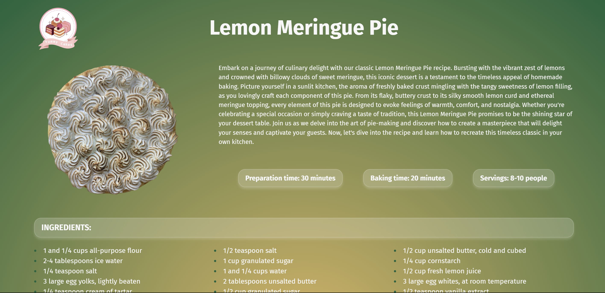

# Yummy Cakes
Yummy Cakes is a web application born out of a personal project following the completion of the Nuclio Digital School Bootcamp in June 2023. Leveraging data from MongoDB, it presents a delightful and dynamic experience tailored for cake enthusiasts everywhere.

## Table of Contents

1. Project Description
2. Platform Walkthrough
3. Technologies Used
4. Installation
5. Project Lead
   
# Project Description
Yummy Cakes is an adaptable web application crafted to seamlessly adjust to various screen sizes, including PCs, mobile devices, and tablets. It empowers users to explore the specific ingredients of each cake and effortlessly navigate to their corresponding recipes.

The frontend is meticulously constructed with React and CSS, ensuring a polished and user-friendly interface. Complementing this, a MongoDB database has been meticulously configured on the backend to efficiently store and manage cake-related data, while Cloudinary serves as the robust platform for storing and optimizing images.

This project serves a dual purpose: to reinforce the concepts mastered during the completion of the master's program and to experiment with cutting-edge techniques in web development.

 

# Platform Walkthrough

### Home Page
Visitors to this web application are greeted by a vibrant and intuitive UX/UI design. Users are promptly presented with a concise description of the displayed cake and can seamlessly navigate to its corresponding recipe.

At the center of the page, a prominent cake captures attention, dynamically rotating with each press of the navigation buttons. These buttons are conveniently located on either side of the navbar positioned atop the cake, following a circular layout.

The background and ingredients dynamically adjust based on the selected cake, with each cake featuring a distinct color scheme for easy identification.


### Recipes page
When the user clicks on the "View recipe" button, they are automatically directed to the page of the selected cake's recipe. Similar to the homepage, the recipe page dynamically adopts the same color associated with the cake.

Detailed elements retrieved from MongoDB through React-Query and Axios can be viewed, including a detailed description, image, ingredients, services, preparation time, and instructions for making these delicious cakes.

At the bottom in a footer format, the list of remaining cakes can be seen, with the cake currently being viewed extracted from it. Clicking on it allows navigation to the recipe page with a smooth scroll that positions the user directly at the top of the page without the need for manual scrolling.

In the top left corner, the logo of the page has been added for direct navigation to the homepage.




### Responsive Design

Yummy Cakes has been meticulously crafted to seamlessly adapt to a diverse range of PC screens, mobile devices, and tablets, including variations in rotation.

In the mobile version, an additional functionality has been introduced: a button for smooth scrolling to the top of the page, enhancing user navigation throughout the website.

And that's it!
Now, all that's left is to indulge in these yummy cakes and enjoy every delicious bite!


# Technologies Used
### Main Front-End Libraries:

* React
* React-Router-Dom
* React-Query
* Axios

### Main Back-End Libraries:

* Express
* Mongoose (Database)
* MongoDB (Database)
* Cloudinary (Image storage)

# Installation
## 1. Prerequisites

To run Yummy Cakes locally, you need to have installed:
* Node.js
* MongoDB

## 2. Configuration:

* Clone this repository to your local machine:
````
$ git clone https://github.com/Ananke85/YummyCakes.git
````
* Install project dependencies:
```
$ npm install
````
* Create a .env file in the project root and add the following environment variables:
```
PORT: 3005
MONGO_URL: [ ]
CLOUDINARY_CLOUD_NAME:[ ]
CLOUDINARY_API_KEY:[ ]
CLOUDINARY_API_SECRET:[ ]
CLOUDINARY_URL:[ ]

````
* Open a terminal and start the server:
```
$ cd backend
$ npm start
````
* Open a different terminal and start the client:
```
$ cd cakes
$ npm run dev
````
* Open a web browser and go to the following port to view the application:
```
http://localhost:5173/
```

# Project Lead
Lorena Carmona
